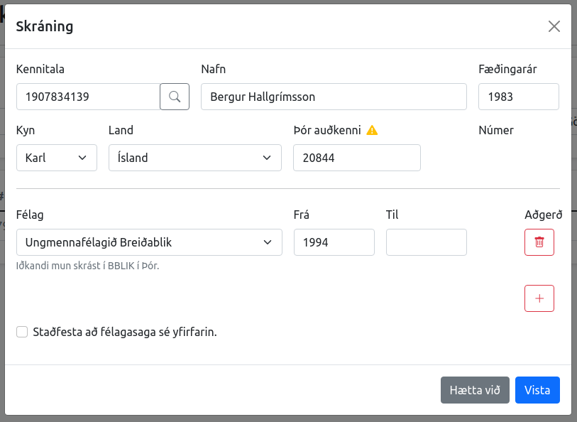

# Afrita iðkanda úr Þór í félagatal


**ATH:** Þar sem Þór er enn ríkjandi mótaforrit eru iðkendur stofnaðir þar. Þór talar hinsvegar ekki við félagatalið og það myndast misræmi. Félagatalið talar hinsvegar við Þór. Lausnin er því að afrita notendann frá Þór yfir í félagatalið og breyta honum þar.


Þegar iðkandi finnst ekki í félagatalinu birtist tómur list.

<figure><figcaption>
Iðkanda finnst ekki í félagatalinu
</figcaption></figure>

1.  Veldu hnappinn stofna upp í hægra horninu.\

    <figure><figcaption>
Gluggi til að nýskrá iðkendur
</figcaption></figure>

2\. Skráðu inn kennitöluna án bandstriks og smelltu á stækkunarglerið. Við það fyllast reitirnir út.\

<figure><figcaption>
Útfyllt form fyrir iðkanda
</figcaption></figure>


**ATH:** Það er mikilvægt að fara yfir reitina. Í sumum tilfella eru ekki allar upplýsingar í Þór t.d. Land eða fyrsta keppnisár. Í þeim tilfellum þarf að handfylla þá reiti út.


3\. Smellið á vista. Notandinn er núna kominn inn í félagatalið.

4\. Núna er hægt að leita eftir notenda og breyta þeim upplýsingum sem óskað var eftir.
