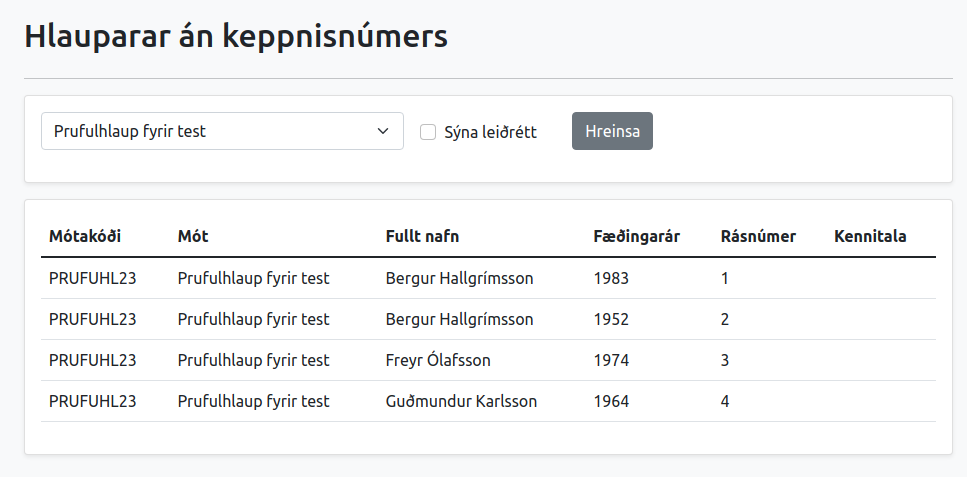
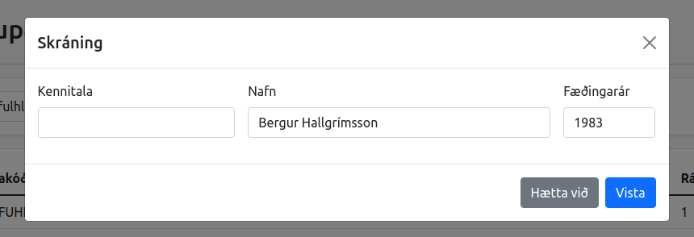

# Úrslit hlaupa í afrekaskrá

## Þór

Staðan í dag er að eina leiðin til að koma gögnum inn í afrekaskrá er í gegnum Þór. Skrifstofa FRÍ hefur aðgang að sérstöku viðmóti þar sem hægt er að skrá upplýsingar um hlaup og tengja við csv skrá sem inniheldur úrslitin.

Kerfið býr til mótið eða hlaupið í Þór með upplýsingunum sem voru gefnar og setur inn úrslitin. Það reynir síðan að finna kennitölur þar sem þær vantar eða laga gallaðar kennitölur. Þetta er gert til að finna einkvæmt keppendanúmer fyrir hlauparann. Öll afrek eru skráð á þetta einkvæma númer til að tryggja að úrslitin fari á réttan aðila.


**ATH:** Núverandi reglugerð gerir kröfu um að mótshaldari skili kennitölu en það var ekki tilfellið áður fyrr sem gerði erfitt fyrir að tryggja að árangrar færu á rétta aðila.


Þegar kerfið hefur skráð mótið, sett inn úrslitin og reynt að finna kennitölur og keppendanúmer þá skrifar það út í villuskrá lista af öllum keppendum sem það gat ekki lagað sjálfkrafa.

Villulistinn er aðgengilegur í stjórnkerfi FRÍ.

## Stjórnkerfi FRÍ

Undir flokknum _Hlauparar án keppnisnúmers_ má sjá lista af keppendum þar sem Þór gat ekki fundið eða lagað kennitölu og þar af leiðandi ekki fundið keppendanúmer sem tryggir að árangur skráist á réttan aðila.

<figure><figcaption>
Taflan sýnir keppenda sem keppti á "Prufuhlaupi fyrir test" en með engri kennitölu.
</figcaption></figure>

Með því að smella á línuna opnast gluggi þar sem skrifstofa FRÍ getur lagfært skráningu.

<figure><figcaption>
Gluggi til að leiðrétta skráningu
</figcaption></figure>

Þegar búið er að skrá inn rétta kennitölu og vista þá uppfærist listinn og leiðrétt kennitala og keppendanúmer er sýnilegt.

<figure><figcaption>
Taflan sýnir núna ekki einstaklinga með leiðrétta kennitölu.
</figcaption></figure>

Við þessa aðgerð uppfærði kerfið villulistann, skráninguna á mótinu og færði hlaupið inn í afrekaskrá. Hlauparinn er nú með rétta kennitölu og keppendanúmer á mótinu og kominn inn í afrekakskrá.